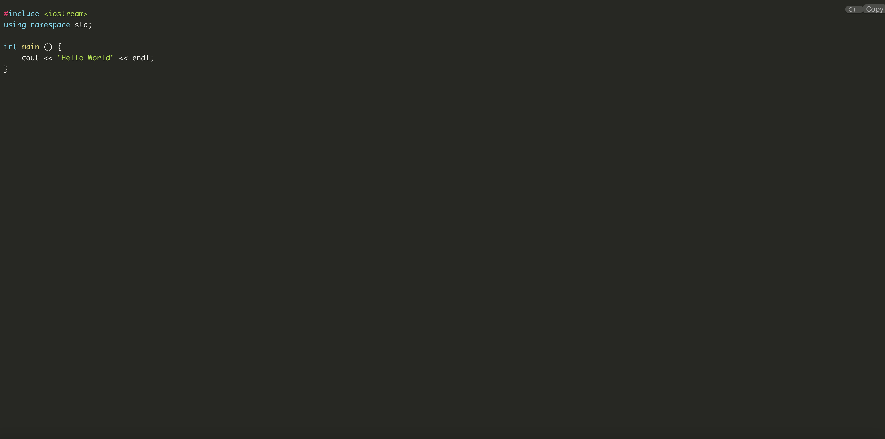

## CodeVault
A relational database-based website for managing interview questions, featuring two types of questions - algorithmic and textual.

CodeVault是一个基于关系数据库的网站，旨在管理面试问题。它提供了两种类型的问题：算法题和文字题。通过这个平台，用户可以方便地整理、组织和浏览各种面试题目。无论是需要挑战智力的算法问题，还是需要表达思考能力的文本问题，CodeVault都能满足各种求职者和面试官的需求。这个功能强大的工具，为面试准备提供了可靠的支持，让每个人都能够在面试中发挥出最佳水平。

## 使用方法
前端端口为5172  
后端端口为8765  
分别在vite.config.ts和application.yaml中设置  
数据库连接信息在application.yaml中设置,默认为
jdbc:postgresql://${POSTGRESQL_HOST:localhost}:5432/code_vault  
用户名和密码需要自行设置  
需要执行DDL.sql进行数据库表的创建  

## 项目结构
```
.
├── README.md
├── codevault-backend
│   ├── pom.xml
│   └── src
│       ├── main
│       │   ├── java
│       │   │   └── com.aliersel.codevaultbackend
│       │   │       ├── CodevaultBackendApplication.java
│       │   │       ├── controller
│       │   │       │   ├── UserController.java
│       │   │       │   └── ProblemController.java
│       │   │       |   └── FolderController.java
│       │   │       |   └── api
│       │   │       ├── mapper
│       │   │       │   ├── UserMapper.java
│       │   │       │   └── ProblemMapper.java
│       │   │       |   └── FolderMapper.java
│       │   │       |   └── CommentMapper.java
│       │   │       ├── service
│       │   │       │   ├── impl
│       │   │       │   │   ├── UserServiceImpl.java
│       │   │       │   │   ├── ProblemServiceImpl.java
│       │   │       │   │   └── FolderServiceImpl.java
│       │   │       │   ├── intf
│       │   │       │   │   ├── UserService.java
│       │   │       │   │   ├── ProblemService.java
│       │   │       │   │   └── FolderService.java
│       │   │       ├── config
│       │   │       ├── entity
│       │   │       ├── exception
│       │   │       ├── util
│       │   │       └── security
│       │   └── resources
│       │       ├── application.yaml
├── codevault-frontend
│   ├── package.json
│   ├── vite.config.ts
│   ├── tsconfig.json
│   ├── yarn.lock
│   ├── src
│   │   ├── App.vue
│   │   ├── main.ts
│   │   ├── style.css
│   │   ├── api
│   │   ├── assets
│   │   ├── components
│   │   ├── router
│   │   ├── store
│   │   ├── utils
│   │   └── views

```

## 项目技术栈
前端：Vue3 + TypeScript + Vite + Naive UI  
后端：Spring Boot + MyBatis + PostgreSQL

## 项目特色
- 采用前后端分离的架构，前端使用Vue3，后端使用Spring Boot
- 前端使用Vite作为构建工具，开发效率高
- 前端使用TypeScript，代码更加规范，可读性更高
- 前端使用Naive UI作为UI框架，界面美观，交互友好
- 后端使用MyBatis作为ORM框架，代码简洁，易于维护
- 后端使用PostgreSQL作为数据库，支持大规模数据存储
- 后端使用Spring Security作为安全框架，保证用户信息安全
- 后端使用JWT作为认证方式，保证用户信息安全
- 后端使用Swagger作为API文档生成工具，方便前后端对接
- 后端使用Lombok作为代码简化工具，提高开发效率

## 项目功能
- 用户注册、登录
- 面试题目的增删改查
- 面试题目的分类管理
- 面试题目的归档(文件夹创建、删除、重命名、移动)
- 面试题目的添加笔记、代码，支持多媒体和多种语言

## 项目截图




## 项目开源协议
MIT License

## 项目参考资料
- [Spring Boot](https://spring.io/projects/spring-boot)
- [MyBatis](https://mybatis.org/mybatis-3/)
- [PostgreSQL](https://www.postgresql.org/)
- [Spring Security](https://spring.io/projects/spring-security)
- [JWT](https://jwt.io/)
- [Swagger](https://swagger.io/)
- [Lombok](https://projectlombok.org/)
- [Vue3](https://v3.vuejs.org/)
- [TypeScript](https://www.typescriptlang.org/)
- [Vite](https://vitejs.dev/)
- [Naive UI](https://www.naiveui.com/)
